<!-- HERO SECTION // ATELIER SHAMBHAVI -->

 

<!-- HAUTE COUTURE RIBBON DIVIDER -->

 

<!-- WHO IS SHAMBHAVI? // IDENTITY DOSSIER -->

 

<!-- HAUTE COUTURE RIBBON DIVIDER -->

 

<!-- DREAMHOUSE DASHBOARD // METRICS -->

 

<!-- HAUTE COUTURE RIBBON DIVIDER -->

 

<!-- DREAM PROJECTS // THE ATELIER COLLECTION -->

### ✦ Atelier Project Directory

| Project | Domain / Category | Primary Architecture | Description |
| :--- | :--- | :--- | :--- |
| **[Ovio](https://github.com/Shambhavi500/Ovio)** | `AI / MULTI-AGENT` | **Python** · Multi-Agent Orchestration | AI-powered DaVinci Resolve video editing assistant and multi-agent workflow engine |
| **[Aira](https://github.com/Shambhavi500/Aira)** | `FINTECH / AUTONOMOUS` | **TypeScript** · Distributed Systems | Autonomous Revenue Recovery Operating System for the Indian Fintech Ecosystem |
| **[KrishiSahAI](https://github.com/Shambhavi500/KrishiSahAI)** | `AGRITECH / AI ADVISORY` | **Python** · Machine Learning | State-of-the-art AI advisory bringing precision agriculture to Indian farmhouses |
| **[KrishiSetu](https://github.com/Shambhavi500/KrishiSetu)** | `BLOCKCHAIN / SUPPLY CHAIN` | **TypeScript** · Web3 | Decentralized agri-supply chain solution ensuring transparent and fair farmer pricing |
| **[AlphaTrader-RL](https://github.com/Shambhavi500/AlphaTrader-RL)** | `QUANT / REINFORCEMENT LEARNING` | **Python** · RL Trading Engine | Reinforcement learning algorithms for automated trading execution |
| **[StockItUp](https://github.com/Shambhavi500/StockItUp)** | `FINTECH / REAL-TIME` | **JavaScript** · Live APIs | Real-time market tracking platform with interactive financial charting |
| **[NDVI_satellite](https://github.com/Shambhavi500/NDVI_satellite)** | `EARTH OBSERVATION / GIS` | **JavaScript** · Spectral Bands | Normalized Difference Vegetation Index analysis using multi-spectral satellite imagery |
| **[EPeekPahani](https://github.com/Shambhavi500/EPeekPahani)** | `MOBILE / ANDROID` | **Kotlin** · Android SDK | Digital crop survey and agricultural ground-truth verification application |

 

<!-- HAUTE COUTURE RIBBON DIVIDER -->

 

<!-- TECH WARDROBE // THE ENGINEERING ENSEMBLE -->

 

<!-- HAUTE COUTURE RIBBON DIVIDER -->

 

<!-- DEVELOPER RUNWAY // CODE CADENCE -->

 

<!-- HAUTE COUTURE RIBBON DIVIDER -->

 

<!-- CAREER EDITION // ATELIER MILESTONES -->

 

<!-- HAUTE COUTURE RIBBON DIVIDER -->

 

<!-- FOOTER // DREAMHOUSE CLOSING -->

  

  

Curated with intention &amp; precision in the <b>Atelier No. 500</b>. Inspired by Barbie Couture &amp; Modern Systems Engineering.

