<!-- 01. HERO SECTION // ATELIER NO. 500 -->

 

<!-- FLOWING PINK CURVE DIVIDER -->

 

<!-- 02. THE PERSON // ENGINEERING PROFILE & FOCUS -->

 

<!-- FLOWING PINK CURVE DIVIDER -->

 

<!-- 03. THE WINS // HACKATHONS & ENGINEERING HONORS -->

 

<!-- FLOWING PINK CURVE DIVIDER -->

 

<!-- 04. PROFESSIONAL EDIT // INDUSTRY APPOINTMENT & ACADEMICS -->

 

<!-- FLOWING PINK CURVE DIVIDER -->

 

<!-- 05. THE WORK // FEATURED PROJECTS & ARCHITECTURES -->

### ✦ Curated Atelier Architectures

| Project | Domain / Category | Primary Architecture | Description & Recognition |
| :--- | :--- | :--- | :--- |
| **[KrishiSahAI](https://github.com/Shambhavi500/KrishiSahAI)** | `AGRITECH / AI ADVISORY` | **Python** | Flagship AI agriculture platform for crop recommendations, soil telemetry & rural decision support. `1ST PLACE · TECHFIESTA '26` |
| **[Ovio](https://github.com/Shambhavi500/Ovio)** | `AI / MULTI-AGENT` | **Python** | Cinema-grade AI DaVinci Resolve editing assistant & multi-agent workflow engine. `AUTONOMOUS WORKFLOW` |
| **[Aira](https://github.com/Shambhavi500/Aira)** | `FINTECH / AUTONOMOUS OS` | **TypeScript** | Autonomous Revenue Recovery Operating System for Indian fintech ecosystem & payment pipelines. `SYSTEM ARCHITECTURE` |
| **[AlphaTrader-RL](https://github.com/Shambhavi500/AlphaTrader-RL)** | `QUANT / REINFORCEMENT LEARNING` | **Python** | Gymnasium RL trading environment on 5+ yrs NSE data with 50-dim observation space and Docker. `FLAGSHIP RL RESEARCH` |
| **[KRISHI-PRABANDH](https://github.com/Shambhavi500/KRISHI-PRABANDH)** | `GOV-TECH / AGRONOMY` | **Multi-stack** | AI governance layer with OCR fraud detection & satellite NDVI spectral validation. `NATIONAL RUNNER-UP · ₹15L GRANT` |
| **[NDVI_satellite](https://github.com/Shambhavi500/NDVI_satellite)** | `EARTH OBSERVATION / GIS` | **JavaScript** | Vegetation index analysis using satellite spectral bands and Google Earth Engine. `SPECTRAL REMOTE SENSING` |

 

<!-- FLOWING PINK CURVE DIVIDER -->

 

<!-- 06. THE TELEMETRY // SYSTEM METRICS & TECH DISTRIBUTION -->

 

<!-- FLOWING PINK CURVE DIVIDER -->

 

<!-- 07. THE LAB // AI/ML & ENGINEERING STACK -->

 

<!-- FLOWING PINK CURVE DIVIDER -->

 

<!-- 08. THE BUILD LOG // ACTIVITY RUNWAY & CADENCE -->

 

<!-- FLOWING PINK CURVE DIVIDER -->

 

<!-- 09. THE CLOSING // HAUTE COUTURE SIGNATURE -->

  

  

Curated with intention &amp; precision in the <b>Atelier No. 500</b>. Where Autonomous Intelligence Meets Haute Couture Engineering.

